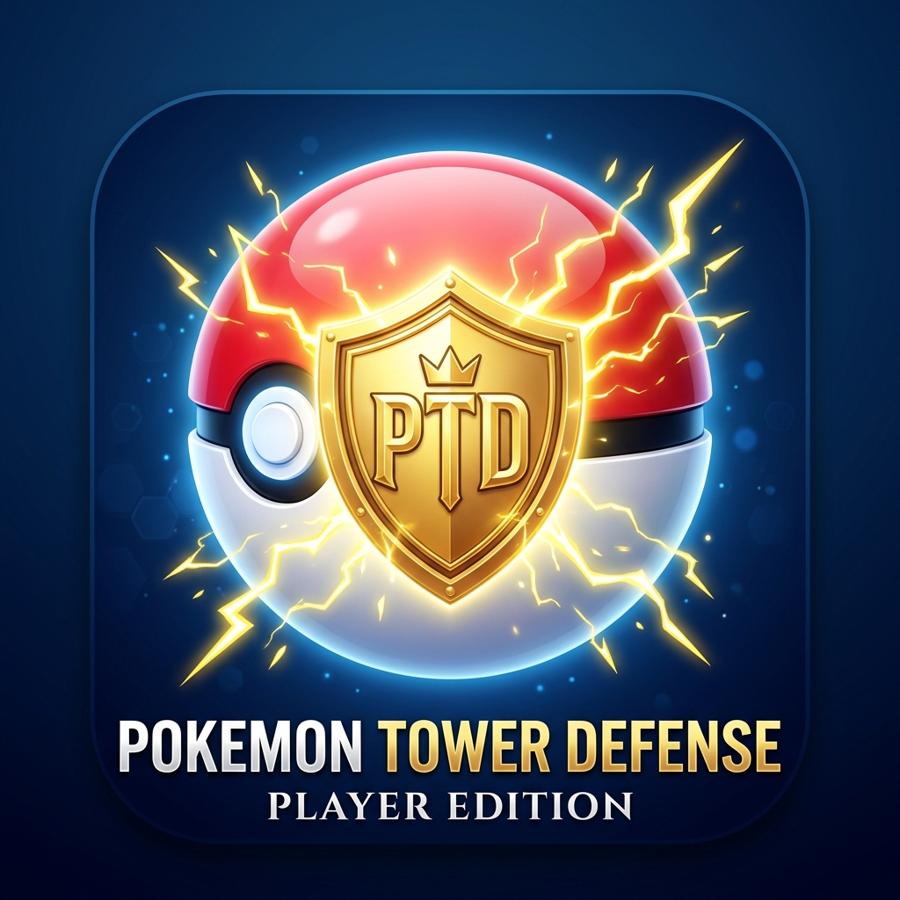

# ⚡ Pokémon Tower Defense — PC Remastered Edition

<p align="center">
  
  &nbsp;&nbsp;&nbsp;&nbsp;&nbsp;&nbsp;&nbsp;&nbsp;
  
</p>

<p align="center">
  <strong>The definitive desktop PC remaster of Pokémon Tower Defense.</strong><br/>
  Featuring responsive widescreen scaling, studio 48kHz audio engine with granular volume controls, anti-jitter cursor smoothing, a full 64-wave Kanto boss campaign, and two dedicated editions: <em>Player Edition</em> and <em>Autonomous AI Developer Edition</em>.
</p>

<p align="center">
  <a href="https://github.com/nemeshisu0/Pokemon-Tower-Defense/releases/tag/v1.0.0"></a>
  
  
  
  
</p>

<p align="center">
  <a href="#-english-documentation">🇬🇧 <strong>English Documentation</strong></a> • 
  <a href="#-documentazione-in-italiano">🇮🇹 <strong>Documentazione in Italiano</strong></a> • 
  <a href="https://github.com/nemeshisu0/Pokemon-Tower-Defense/releases/tag/v1.0.0">📦 <strong>Download JARs</strong></a>
</p>

---

## 📑 Table of Contents / Indice
* [🇬🇧 English Documentation](#-english-documentation)
  * [Key Enhancements & Features](#-key-enhancements--features)
  * [The Two Editions](#-the-two-editions-player-vs-developer)
  * [Installation & Quick Start](#-installation--quick-start)
  * [Gameplay & Tactical Guide](#-gameplay--tactical-guide)
  * [Pokemon Roster & Type Matchups](#-pokemon-roster--type-matchups)
  * [Kanto Campaign & Boss Progression](#-kanto-campaign--boss-progression)
  * [Controls & Shortcuts](#-controls--shortcuts)
* [🇮🇹 Documentazione in Italiano](#-documentazione-in-italiano)
  * [Miglioramenti e Funzionalità](#-miglioramenti-e-funzionalità)
  * [Le Due Versioni (Giocatore vs Sviluppatore)](#-le-due-versioni-giocatore-vs-sviluppatore)
  * [Installazione e Avvio Rapido](#-installazione-e-avvio-rapido)
  * [Guida di Gioco e Tattiche](#-guida-di-gioco-e-tattiche)
  * [Roster Pokémon ed Efficacia Tipi](#-roster-pokémon-ed-efficacia-tipi)
  * [Campagna di Kanto e Boss](#-campagna-di-kanto-e-boss)
  * [Comandi e Tasti Rapidi](#-comandi-e-tasti-rapidi)

---

# 🇬🇧 English Documentation

## ✨ Key Enhancements & Features

* 🖥️ **Widescreen HD Adaptation & Proportional Scaling**:  
  Eliminated clumsy mobile letterboxing on PC monitors. The game area smoothly scales to any monitor resolution (1280x760 default, Fullscreen F11) with elegant dynamic lateral sidebars for widescreen monitors.
* 🔊 **Studio Audio Engine with Full Volume Control**:  
  Rewritten 48kHz audio mixer supporting separate real-time sliders for **Master Volume**, **BGM (Music)**, and **SFX (Sound Effects)**, plus an instant mute toggle.
* 🛡️ **Smooth Mouse Input & Zero-Jitter UI**:  
  Engineered an anti-jitter coordinate boundary listener that prevents window shake and infinite hover zoom loops.
* 👑 **Full 64-Wave Kanto Campaign (Cap at Level 65)**:  
  Structured all 64 waves with 13 authentic Kanto Gym Leaders, Elite Four champions, and Grand Finale against Champion Blue at Wave 64, triggering a celebratory victory screen and triumphant fanfare.
* ⚖️ **Type-Matchup Mechanics & Status Effects**:  
  Authentic damage multipliers (Water 2x vs Fire/Rock, Fire 2x vs Grass, Electric 2x vs Water). Status conditions including **Electric Paralysis** (-50% enemy speed) and **Fire Burn** (damage over time).
* 🐧 **Full Arch Linux & Desktop Integration**:  
  Comes with standalone `.desktop` application launchers and dedicated 512x512 high-resolution 3D icons for your application launcher.

---

## 🎮 The Two Editions: Player vs. Developer

This repository maintains two distinct, specialized editions:

| Feature | 🎮 Player Edition (`main` branch) | 🤖 Developer Edition (`developer` branch) |
| :--- | :---: | :---: |
| **Target Audience** | Human Players | Game Designers, Developers & AI Testers |
| **Bot Autoplay & AI** | ❌ Completely removed (Pure skill) | ✅ Autonomous Heuristic AI Bot |
| **Top HUD Layout** | Clean (Pause, Speed 1x/2x/3x, Mute, Settings) | Includes `🤖 AI: ON/OFF` toggle button |
| **Right Sidebar** | **Trainer Tactical Panel** (Type Chart & Tips) | **Live Telemetry Panel** (Real-time DPS & Decision Logs) |
| **Disk Telemetry** | ❌ No background files written | ✅ Generates `balance_report.md` & `balance_telemetry.json` |
| **Victory Screen** | "Play Again" button | "Play Again" + "Export Balance Report" |
| **Launcher Script** | `./run-player.sh` | `./run-dev.sh` |

---

## 🚀 Installation & Quick Start

### Option A: Direct JAR Download (No Compilation Needed)
1. Go to the [Releases Page](https://github.com/nemeshisu0/Pokemon-Tower-Defense/releases/tag/v1.0.0).
2. Download either `pokemon-tower-defense-player.jar` or `pokemon-tower-defense-dev.jar`.
3. Launch with Java 17+:
   ```bash
   java -jar pokemon-tower-defense-player.jar
   ```

### Option B: Run from Cloned Repository
Ensure you have OpenJDK 17 (or newer) installed.

```bash
# Clone the repository
git clone https://github.com/nemeshisu0/Pokemon-Tower-Defense.git
cd Pokemon-Tower-Defense

# Launch the Player Edition
./run-player.sh

# Or launch the Developer / AI Edition
./run-dev.sh
```

### Option C: Build from Source
```bash
# Build the fat standalone JAR using Maven
./build.sh
```

### Option D: Install Linux Desktop Shortcuts (.desktop)
To search and launch the game directly from your application launcher (GNOME, KDE Plasma, Rofi, etc.):
```bash
# Install icons and application entries
mkdir -p ~/.local/share/icons/hicolor/512x512/apps ~/.local/share/applications
cp assets/images/pokemon-tower-defense-player.png ~/.local/share/icons/hicolor/512x512/apps/
cp assets/images/pokemon-tower-defense-dev.png ~/.local/share/icons/hicolor/512x512/apps/
cp pokemon-tower-defense.desktop ~/.local/share/applications/
cp pokemon-tower-defense-dev.desktop ~/.local/share/applications/
update-desktop-database ~/.local/share/applications 2>/dev/null || true
```

---

## 🎯 Gameplay & Tactical Guide

### 1. Objective
Defend the Gym at all costs! Trainers will walk along the designated path toward your Gym. If a regular trainer reaches the gym, you lose **1 HP**. If a Gym Leader or Boss breaches your defense, you lose **3 HP**. Your Gym starts with **25 HP**.

### 2. Placing & Managing Defenders
* **Place Bush/Turret**: Click on any placeable green grass tile. The initial price is **$100**, and dynamically scales with each turret placed.
* **Assign Pokémon**: Click on any placed turret to open the selection bar. Click **"Cambia ❯" (Switch)** to rotate between your unlocked Pokémon.
* **Range Circle**: Clicking a turret reveals its attack radius.

---

## ⚡ Pokemon Roster & Type Matchups

### Unlocked Defenders

| Pokémon | Type | Unlock Price | Base Damage | Attack Range | Cooldown | Special Status Effect |
| :---: | :---: | :---: | :---: | :---: | :---: | :--- |
| **Rattata** | Normal | Free (Starter) | 10 | 120 px | 6 ticks | Reliable early game defense |
| **Pikachu** | Electric | $250 | 15 | 160 px | 5 ticks | ⚡ **Paralysis**: Halves enemy movement speed (-50%) |
| **Squirtle** | Water | $500 | 25 | 180 px | 7 ticks | 💧 **Water Blast**: 2x damage against Rock & Fire |
| **Charizard** | Fire | $1000 | 75 | 220 px | 8 ticks | 🔥 **Burn**: Applies heavy damage-over-time |

### Elemental Effectiveness Table

| Attacker Type | Strong Against (2.0x Damage) | Weak Against (0.5x Damage) |
| :--- | :--- | :--- |
| 💧 **Water** (Squirtle) | 🔥 Fire, 🪨 Rock | 💧 Water, 🌿 Grass |
| 🔥 **Fire** (Charizard) | 🌿 Grass | 💧 Water, 🔥 Fire, 🪨 Rock |
| ⚡ **Electric** (Pikachu) | 💧 Water | ⚡ Electric, 🌿 Grass, 🪨 Rock |
| 🌿 **Grass** | 💧 Water, 🪨 Rock | 🔥 Fire, 🌿 Grass |
| ⚪ **Normal** (Rattata) | Balanced against all types | Resisted by 🪨 Rock (0.6x) |

---

## 👑 Kanto Campaign & Boss Progression

Bosses spawn every 5 waves, leading up to the final showdown at Wave 64:

```
[Wave 1-4] Early Encounters ➔ [W5] Brock (Rock) ➔ [W10] Misty (Water) ➔ [W15] Lt. Surge (Electric)
➔ [W20] Erika (Grass) ➔ [W25] Koga (Poison/Grass) ➔ [W30] Sabrina (Psychic) ➔ [W35] Blaine (Fire)
➔ [W40] Giovanni (Ground/Rock) ➔ [W45] Lorelei (Ice/Water) ➔ [W50] Bruno (Fighting/Rock)
➔ [W55] Agatha (Ghost/Grass) ➔ [W60] Lance (Dragon/Fire) ➔ [W64] CHAMPION BLUE ➔ VICTORY (Lv. 65)!
```

---

## ⌨️ Controls & Shortcuts

| Action | Control |
| :--- | :--- |
| **Toggle Fullscreen** | <kbd>F11</kbd> |
| **Pause / Resume** | <kbd>Space</kbd> or <kbd>P</kbd> |
| **Place Turret** | <kbd>Left Click</kbd> on grass tile |
| **Inspect / Switch Pokemon** | <kbd>Left Click</kbd> on turret bush |
| **Cycle Game Speed** | Click the `1x` / `2x` / `3x` HUD button |
| **Audio Settings** | Click `⚙ Settings` in top HUD |

---

# 🇮🇹 Documentazione in Italiano

## ✨ Miglioramenti e Funzionalità

* 🖥️ **Adattamento Schermo PC & Scaling Proporzionale**:  
  Risolto il problema della visuale verticale e delle bande nere. Il gioco scala fluidamente su qualsiasi risoluzione PC (1280x760 di base, Schermo Intero con F11) con eleganti barre laterali informative per monitor widescreen.
* 🔊 **Motore Audio a 48kHz con Regolazione del Volume**:  
  Nuovo mixer audio con cursori indipendenti per **Volume Generale**, **Musica** ed **Effetti Sonori (SFX)**, oltre al tasto rapido muto.
* 🛡️ **Puntatore Fluido senza Tremolio**:  
  Corretto il bug di tremolio/jittering del puntatore del mouse e i loop infiniti di zoom all'apertura dei menu.
* 👑 **Campagna Completa di Kanto fino al Livello 65**:  
  Tutte le 64 ondate sono state strutturate con i 13 autentici Capipalestra e Superquattro di Kanto, culminando nella battaglia finale contro il Campione Blu all'Ondata 64 con fanfara trionfale.
* ⚖️ **Sistema di Efficacia Elementale ed Effetti di Stato**:  
  Danni raddoppiati per le debolezze elementali (Acqua 2x su Fuoco/Roccia, Fuoco 2x su Erba, Elettro 2x su Acqua). Effetti di stato attivi come la **Paralisi Elettrica** (-50% velocità) e la **Scottatura di Fuoco** (danno continuo).
* 🐧 **Integrazione Nativa con Arch Linux e Desktop**:  
  File `.desktop` inclusi con icone 3D ad alta definizione dedicate per avviare il gioco direttamente dal menu delle applicazioni.

---

## 🎮 Le Due Versioni: Giocatore vs. Sviluppatore

Il repository è suddiviso in due versioni specializzate:

| Caratteristica | 🎮 Versione Giocatore (`main`) | 🤖 Versione Sviluppatore (`developer`) |
| :--- | :---: | :---: |
| **Destinatari** | Giocatori | Sviluppatori, Tester e Ricercatori AI |
| **Bot AI e Autoplay** | ❌ Disattivato (Solo abilità manuale) | ✅ Bot AI Autonomo con Apprendimento Euristico |
| **Interfaccia Superiore** | Pulita (Pausa, Velocità 1x/2x/3x, Audio, Impostazioni) | Include il pulsante toggle `🤖 AI: ON/OFF` |
| **Barra Laterale Destra** | **Pannello Allenatore** (Efficacia Tipi e Consigli) | **Pannello Telemetria** (DPS e Log Decisionali in tempo reale) |
| **Report su Disco** | ❌ Nessun file scritto su disco | ✅ Esportazione automatica di `balance_report.md` e JSON |
| **Schermata di Vittoria** | Solo pulsante "Rigioca dall'Inizio" | Pulsante "Rigioca" + "Esporta Report" |
| **Script di Avvio** | `./run-player.sh` | `./run-dev.sh` |

---

## 🚀 Installazione e Avvio Rapido

### Metodo A: Download Diretto dei File JAR (Senza Compilare)
1. Apri la pagina delle [Release Ufficiali](https://github.com/nemeshisu0/Pokemon-Tower-Defense/releases/tag/v1.0.0).
2. Scarica il file `pokemon-tower-defense-player.jar` (oppure `pokemon-tower-defense-dev.jar`).
3. Avvialo con Java 17 o superiore:
   ```bash
   java -jar pokemon-tower-defense-player.jar
   ```

### Metodo B: Avvio da Repository Clonato
Assicurati di avere OpenJDK 17 o superiore installato sul tuo sistema Linux:

```bash
# Clona il repository
git clone https://github.com/nemeshisu0/Pokemon-Tower-Defense.git
cd Pokemon-Tower-Defense

# Avvia la Versione Giocatore
./run-player.sh

# Oppure avvia la Versione Sviluppatore con Bot AI
./run-dev.sh
```

### Metodo C: Compilazione da Sorgente
```bash
# Compila il pacchetto fat JAR con Maven
./build.sh
```

### Metodo D: Installazione Icone e Lanciatori Desktop
Per aprire il gioco comodamente dal menu delle applicazioni di Linux (GNOME, KDE Plasma, Rofi, ecc.):
```bash
mkdir -p ~/.local/share/icons/hicolor/512x512/apps ~/.local/share/applications
cp assets/images/pokemon-tower-defense-player.png ~/.local/share/icons/hicolor/512x512/apps/
cp assets/images/pokemon-tower-defense-dev.png ~/.local/share/icons/hicolor/512x512/apps/
cp pokemon-tower-defense.desktop ~/.local/share/applications/
cp pokemon-tower-defense-dev.desktop ~/.local/share/applications/
update-desktop-database ~/.local/share/applications 2>/dev/null || true
```

---

## 🎯 Guida di Gioco e Tattiche

### 1. Obiettivo di Gioco
Difendi la Palestra a ogni costo! Gli allenatori nemici percorrono la strada verso la Palestra. Se un allenatore normale attraversa la difesa perdi **1 HP**. Se un Capopalestra o Boss supera la linea perdi **3 HP**. La tua Palestra inizia con **25 HP**.

### 2. Posizionamento e Gestione Torrette
* **Piazza Torretta**: Clicca su una casella d'erba verde. Il costo iniziale è di **$100** e sale gradualmente ad ogni torretta acquistata.
* **Assegna Pokémon**: Clicca su un cespuglio posizionato per aprire il pannello di controllo. Clicca **"Cambia ❯"** per alternare i tuoi Pokémon sbloccati.
* **Visualizza Raggio d'Attacco**: Cliccando una torretta compare il cerchio azzurro che indica il raggio di tiro.

---

## ⚡ Roster Pokémon ed Efficacia Tipi

### Difensori Sbloccabili

| Pokémon | Tipo | Costo Pokédex | Danno Base | Raggio Tiro | Tempo Ricarica | Effetto Speciale |
| :---: | :---: | :---: | :---: | :---: | :---: | :--- |
| **Rattata** | Normale | Gratuito | 10 | 120 px | 6 tick | Difesa essenziale per le prime ondate |
| **Pikachu** | Elettro | $250 | 15 | 160 px | 5 tick | ⚡ **Paralisi**: Dimezza la velocità nemica (-50%) |
| **Squirtle** | Acqua | $500 | 25 | 180 px | 7 tick | 💧 **Idropompa**: Danno 2x super-efficace su Roccia e Fuoco |
| **Charizard** | Fuoco | $1000 | 75 | 220 px | 8 tick | 🔥 **Scottatura**: Applica gravi danni continui nel tempo |

### Tabella Debolezze Elementali

| Tipo Attaccante | Super Efficace (Danno 2.0x) | Poco Efficace (Danno 0.5x) |
| :--- | :--- | :--- |
| 💧 **Acqua** (Squirtle) | 🔥 Fuoco, 🪨 Roccia | 💧 Acqua, 🌿 Erba |
| 🔥 **Fuoco** (Charizard) | 🌿 Erba | 💧 Acqua, 🔥 Fuoco, 🪨 Roccia |
| ⚡ **Elettro** (Pikachu) | 💧 Acqua | ⚡ Elettro, 🌿 Erba, 🪨 Roccia |
| 🌿 **Erba** | 💧 Acqua, 🪨 Roccia | 🔥 Fuoco, 🌿 Erba |
| ⚪ **Normale** (Rattata) | Danno neutro su tutti | Resistito da 🪨 Roccia (0.6x) |

---

## 👑 Campagna di Kanto e Boss

I boss appaiono ogni 5 ondate fino alla grande sfida finale:

```
[Ondate 1-4] Allenatori base ➔ [W5] Brock (Roccia) ➔ [W10] Misty (Acqua) ➔ [W15] Lt. Surge (Elettro)
➔ [W20] Erika (Erba) ➔ [W25] Koga (Veleno/Erba) ➔ [W30] Sabrina (Psico) ➔ [W35] Blaine (Fuoco)
➔ [W40] Giovanni (Terra/Roccia) ➔ [W45] Lorelei (Ghiaccio/Acqua) ➔ [W50] Bruno (Lotta/Roccia)
➔ [W55] Agatha (Spettro/Erba) ➔ [W60] Lance (Drago/Fuoco) ➔ [W64] CAMPIONE BLU ➔ VITTORIA (Liv. 65)!
```

---

## ⌨️ Comandi e Tasti Rapidi

| Azione | Comando |
| :--- | :--- |
| **Attiva/Disattiva Schermo Intero** | <kbd>F11</kbd> |
| **Pausa / Riprendi Gioco** | <kbd>Spazio</kbd> oppure <kbd>P</kbd> |
| **Piazza Torretta Cespuglio** | <kbd>Click Sinistro</kbd> su casella d'erba |
| **Ispeziona / Cambia Pokémon** | <kbd>Click Sinistro</kbd> sulla torretta |
| **Cambia Velocità di Gioco** | Clicca il pulsante `1x` / `2x` / `3x` |
| **Impostazioni & Volume** | Clicca `⚙ Impostazioni` nella barra superiore |

---

<p align="center">
  Realizzato con passione per Pokémon Tower Defense Remastered. Licenza Open Source GPL-3.0.
</p>
